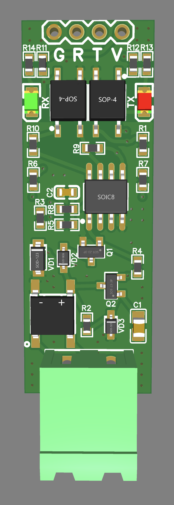
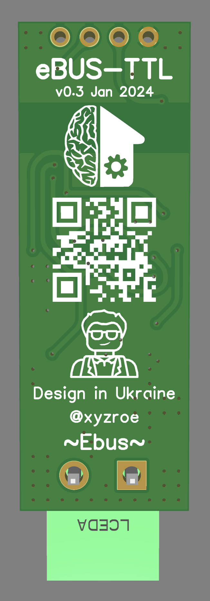

### About
This adapter is designed to connect an eBus compatible boiler to any TTL port (UART-USB/ESP8266/ESP32/Arduino).  
Same size as popular RS485-TTL module for more compatibility.

### Overview

### Photos
This is the base Jekyll theme. You can find out more info about customizing your Jekyll theme, as well as basic Jekyll usage documentation at [jekyllrb.com](https://jekyllrb.com/)

### Schematic

### Gerber & BOM
[Gerber]()  
[BOM]()

### Where to buy?

### Like ♥️?

[jekyll-organization]: https://github.com/jekyll
